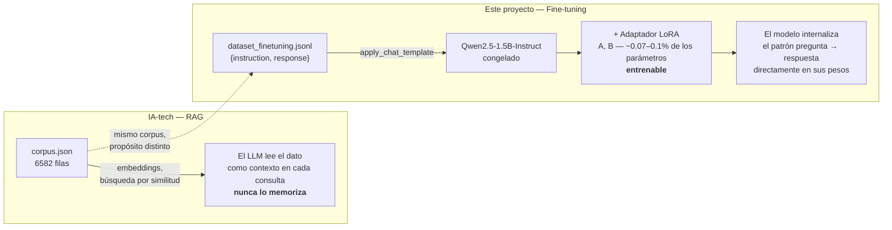
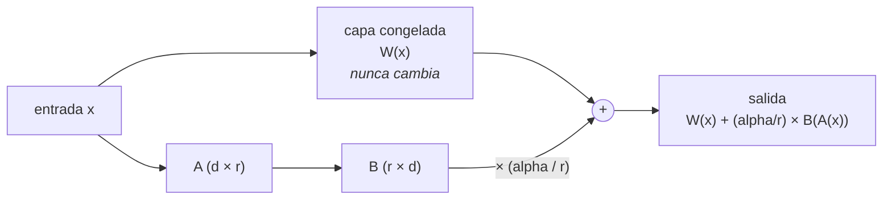

# IA-tech Fine-Tuning — LoRA sobre Qwen2.5-1.5B-Instruct

[](LICENSE)

Proyecto formativo: fine-tuning de un LLM pre-entrenado con **LoRA**
(Low-Rank Adaptation), 100% local y en CPU (sin GPU/CUDA), adaptando
`Qwen2.5-1.5B-Instruct` al corpus de la Polla Mundial 2026.

Es la continuación directa de
[`IA-tech`](https://github.com/Izde13/llm-rag-mundial2026): ahí se construyó
un transformer **desde cero** (~2.8M parámetros) para entender su
arquitectura interna. Aquí se parte de un modelo ya entrenado por otros a
gran escala (1.54B parámetros) y se le enseña, con LoRA, un comportamiento
específico — el flujo real de cómo se adapta un LLM en la práctica.

## Por qué importa la restricción de hardware

Esta máquina no tiene GPU con soporte CUDA (Intel UHD 730 integrada, sin
VRAM dedicada). Eso descarta QLoRA (`bitsandbytes` depende de kernels CUDA)
y obliga a LoRA "clásico" en CPU, en fp32, sin cuantización — más lento
(horas en vez de minutos por entrenamiento), pero sigue ajustando <1% de los
parámetros del modelo. El detalle completo, con las mediciones que
justificaron la decisión, está en
[`PROYECTO_BASE.md`](PROYECTO_BASE.md).

## Arquitectura del proyecto



**Cómo se inserta el adaptador LoRA** (simplificado, ver Fase 1):



`W` es el modelo base (1.54B parámetros, fijo). `A`/`B` son el ajuste
aprendido, factorizado en un rango bajo `r` — la única parte que el
optimizador toca durante el entrenamiento.

## Roadmap y resultados por fase

| Fase | Qué se hizo | Resultado clave | Doc |
|---|---|---|---|
| 0 — Setup y datos | Estructura del repo, elección de modelo base, transformación del corpus a pares instrucción/respuesta | `Qwen2.5-1.5B-Instruct` elegido (6GB RAM, viable); 6582 ejemplos generados, bug de fechas de Excel corregido en 1327 registros | [docs/fase-0](docs/fase-0-setup-y-datos.md) |
| 1 — Fundamentos PEFT/LoRA | Arquitectura real del modelo, instrumentación con adaptador vacío | 0.0705% de parámetros entrenables (1.09M de 1.54B) | [docs/fase-1](docs/fase-1-fundamentos-peft-lora.md) |
| 2 — Entrenamiento | `Trainer` + split train/val 90/10, entrenamiento completo (1 época) | `eval_loss` baja monótono 0.51→0.16 (generaliza, no memoriza); 14.4% de aciertos exactos, 0% en marcadores | [docs/fase-2](docs/fase-2-entrenamiento-lora.md) |
| 3 — Evaluación y comparación | 4 variantes probadas: +épocas, +MLP en `target_modules`, +`r` | Ampliar a MLP fue la palanca más efectiva (14.6%→23.8%); marcadores quedaron con techo estructural (8.2% fijo) | [docs/fase-3](docs/fase-3-evaluacion-comparacion.md) |
| 4 — Merge y portafolio | Fusión del adaptador ganador con `merge_and_unload()`, este README | Modelo fusionado: 22x más pesado (5.9GB vs 270MB), comportamiento idéntico sin depender de `peft` | [docs/fase-4](docs/fase-4-merge-portafolio.md) |

## El hallazgo más interesante del proyecto

Durante la Fase 3 se probó, una variable a la vez, si más épocas, más
capacidad (`r` más alto) o más superficie de ajuste (`target_modules`
ampliado al MLP) mejoraban el 0% de acierto exacto en preguntas de
marcador (ej. "¿qué marcador respondió Fulano al partido X?"):

- Duplicar épocas: casi sin efecto (14.4%→14.6% global).
- Ampliar `target_modules` a las capas MLP: el salto más grande de la fase
  (→23.8% global), en **menos** tiempo de entrenamiento.
- Duplicar `r` (8→16): mejora el global (→28.4%) y las preguntas de tipo
  "otro", pero **no mueve ni un punto** el acierto en marcadores (8.2% en
  ambos casos).

Esto coincide con la hipótesis del paper de ROME (Meng et al., 2022): el
conocimiento factual arbitrario en un transformer vive más en las capas MLP
que en atención. Confirmarlo empíricamente, con datos propios y no solo con
la cita del paper, fue el resultado más valioso de la Fase 3 — y también
mostró el límite: ni más capacidad ni más repetición resuelven un tipo de
dato que es, por naturaleza, arbitrario y de baja frecuencia (memorizar un
marcador de fútbol no tiene patrón lingüístico del que "engancharse").

## Adaptador recomendado

`outputs/adaptador_lora_mlp_r16/` (`target_modules` con MLP, `r=16`) —
mejor resultado global de las 4 variantes comparadas. No versionado en git
(pesos de modelo, ver `.gitignore`); se regenera con el comando de la
sección siguiente.

## Cómo reproducir todo

```bash
# Fase 0: dataset
uv run python src/preparar_dataset.py

# Fase 2: entrenar la variante recomendada (MLP + r=16), dataset completo
uv run python src/entrenar_lora.py --n-ejemplos 0 --epocas 1 --target-mlp --r 16

# Fase 3: evaluar cuantitativamente sobre el set de validación (659 ejemplos)
uv run python src/evaluar_lora.py --dir-adaptador outputs/adaptador_lora_mlp_r16 \
    --salida-json data/processed/evaluacion_lora_mlp_r16.json

# Fase 4: fusionar el adaptador con el modelo base (demo de portafolio)
uv run python src/fusionar_adaptador.py
uv run python src/probar_modelo_fusionado.py
```

Cada comando tarda de minutos (evaluación de subset) a varias horas
(entrenamiento/evaluación completos) en CPU — ver tiempos reales medidos en
cada documento de fase.

## Estructura del repo

```
IA-tech-fine-tuning/
├── data/
│   ├── raw/          # vacío — no se versionan datos crudos propios en esta fase
│   └── processed/    # dataset_finetuning.jsonl y evaluaciones (regenerables, no versionados)
├── src/              # scripts de cada fase (ver tabla de arriba)
├── outputs/          # adaptadores LoRA y modelo fusionado (no versionados, MBs-GBs)
├── tests/            # pytest sobre la preparación del dataset
├── docs/             # documentación detallada por fase
│   └── tutor/        # notas de las sesiones de tutor pedagógico
├── PROYECTO_BASE.md  # objetivo, restricciones de hardware, roadmap completo
└── README.md         # este archivo
```

## Relación con `IA-tech`

| | `IA-tech` | Este proyecto |
|---|---|---|
| Punto de partida | Nada — arquitectura transformer desde cero | Modelo pre-entrenado (`Qwen2.5-1.5B-Instruct`) |
| Técnica | Entrenamiento completo de un modelo propio (~2.8M parámetros) | LoRA: <1% de los parámetros de un modelo 550x más grande |
| Uso del corpus | RAG — el LLM *lee* el corpus como contexto, nunca lo memoriza | Fine-tuning — el corpus *ajusta los pesos* del modelo directamente |
| Objetivo de aprendizaje | Cómo funciona un LLM por dentro | Cómo se adapta un LLM ya entrenado, como se hace en la industria |

## Licencia

[MIT](LICENSE) — libre para usar, copiar, modificar y distribuir, con solo
mantener el aviso de copyright.
